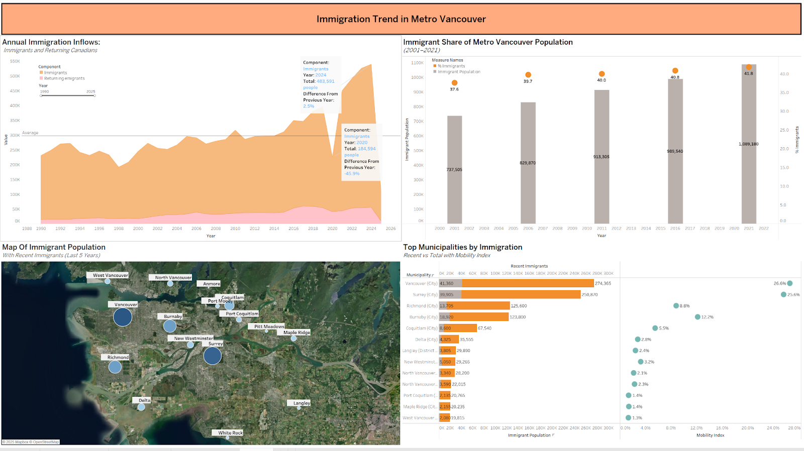
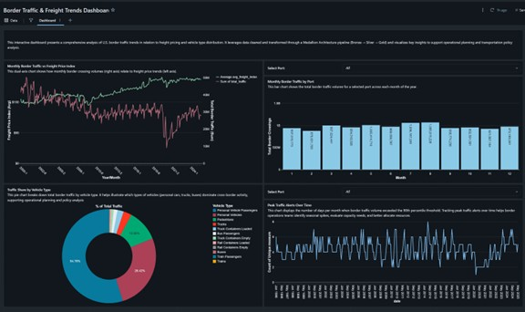
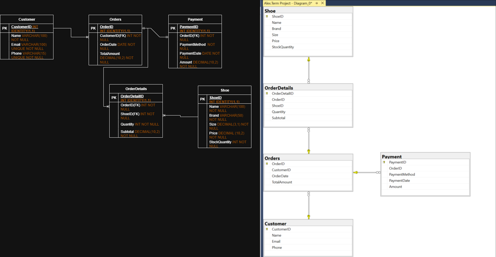

Analytics Portfolio

# Hi, I'm Alex Johann  

Aspiring **Data Analyst / Business Analyst** with a background in data visualization, statistical analysis, and database management.  
This repository highlights selected projects from my portfolio that showcase my skills in **SQL, Python, Tableau, Power BI, and Databricks**.  

---

## Projects  

### [Metro Vancouver Housing & Immigration Trends (1990–2024)](https://github.com/AlexHJohann/alex_portfolio/tree/main/Metro%20Vancouver%20Housing%20%26%20Immigration%20Trends) 
*Tools: Tableau, Excel, Statistics Canada, CMHC datasets*  
- Collected, cleaned, and merged data on housing affordability, construction, and immigration.  
- Built **3 interactive Tableau dashboards** with filters, parameters, dual-axis charts, and maps.  
- Discovered correlations between immigration growth and rising dwelling prices in Metro Vancouver.
  
  

---

### [U.S. Border Crossing Traffic & Freight Trends Analysis](https://github.com/AlexHJohann/alex_portfolio/tree/main/U.S.%20Border%20Crossing%20Traffic%20%26%20Freight%20Trends%20Analysis)  
*Tools: Databricks, PySpark, Medallion Architecture (Bronze, Silver, Gold), SQL, Tableau*  
- Designed an **end-to-end data pipeline** using the Medallion Architecture in Databricks.  
- Integrated U.S. Border Crossing Entry Data with Freight Transportation Services Index.  
- Developed dashboards to track traffic seasonality, high-traffic alerts, and freight price correlations.  
- Provided insights for **logistics optimization** and congestion management.

  

---

### Retail Shoe Store Database Design & Reporting  
*Tools: SQL Server, Relational Database Design, T-SQL*  
- Created a normalized **relational database** for customers, orders, payments, and products.  
- Implemented constraints, primary/foreign keys, and indexing to enforce data integrity.  
- Wrote SQL queries to calculate **daily/monthly sales**, top-selling products, and repeat customers.

  

---

## Skills  

- **Languages & Tools:** SQL, Python, R, Tableau, Power BI, Excel, Databricks, Git  
- **Core Competencies:** Data Cleaning, ETL, Statistical Analysis, Data Visualization, Dashboarding, Business Intelligence, Database Design  

---

## Contact  

- Vancouver, BC  
- alex.hjohann@gmail.com  
- [LinkedIn](https://www.linkedin.com/in/alex-johann-211745268)  

---

⭐️ *Feel free to explore the code, raise issues, or connect with me on LinkedIn!*  
